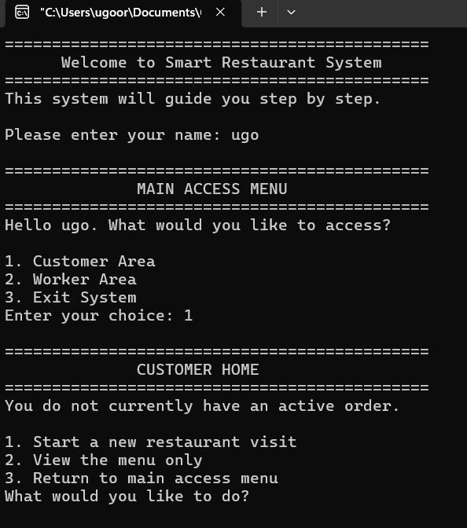
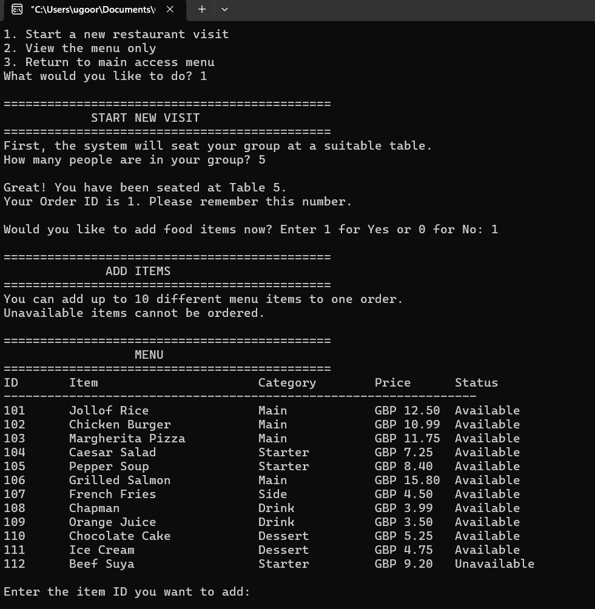
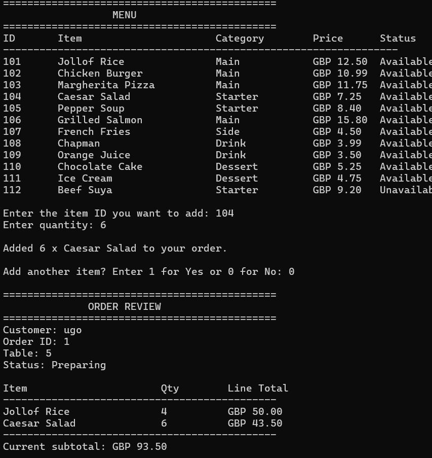
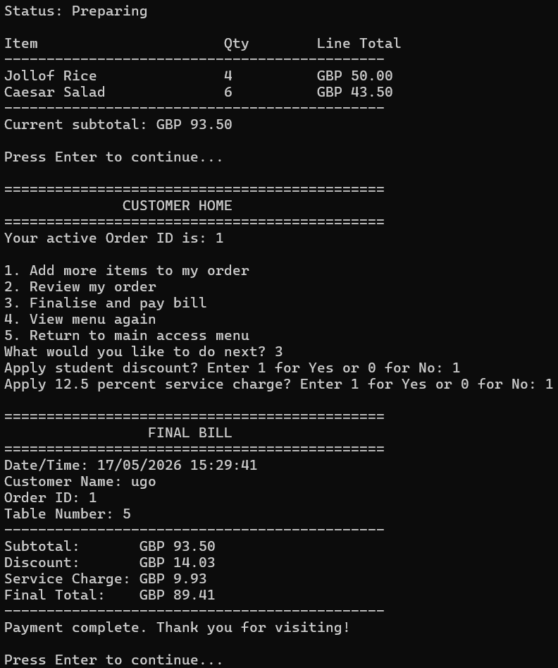

# Restaurant Management System in C

## Overview

This project is a console-based restaurant management system built in C.

It simulates key restaurant operations including menu viewing, table allocation, order creation, billing, discounts, service charge calculation, and order status tracking.

The project was inspired by my interest in food business operations and my experience building Chef Bam, where I saw how important organised systems are behind the scenes of a food business.

## Screenshots

### Main Menu


### Food Menu


### Order Review


### Final Bill


## Features

- Menu display with item categories and prices
- Table allocation based on customer group size
- Order creation for occupied tables
- Multiple item and quantity handling
- Subtotal calculation
- Discount logic
- Student discount handling
- Service charge calculation
- Final bill generation
- Order status tracking
- Input validation for safer user interaction

## Technologies Used

- C programming language
- Console-based user interface
- Structs
- Functions
- Arrays
- Conditional logic
- Loops
- Defensive programming

## How to Run

Compile the program using a C compiler such as GCC:

```bash
gcc restaurant_management_system.c -o restaurant_system
```

Run the program:

```bash
./restaurant_system
```

On Windows:

```bash
restaurant_system.exe
```

## Project Purpose

The goal of this project was to apply core C programming concepts to a system that reflects a real operational environment.

Rather than creating something purely theoretical, I wanted to model the workflow behind a restaurant operation, where customer service, order handling, billing, and business logic all need to work together reliably.

## Future Improvements

- File-based order storage
- Receipt generation
- Admin dashboard
- Inventory management
- Graphical user interface
- Database integration
- Payment processing simulation
